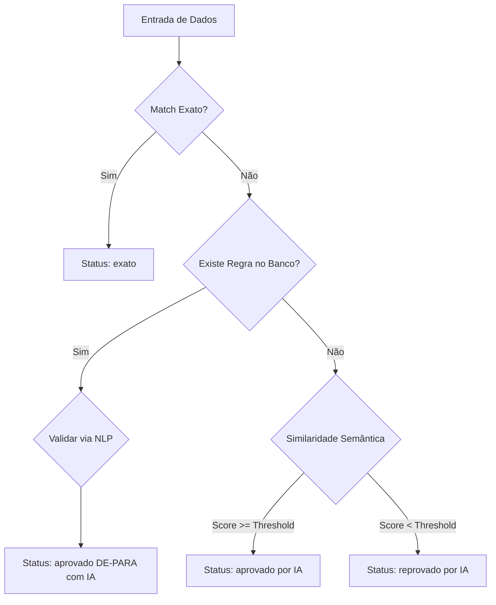

# 🚀 Bencorp - Intelligence Data Integration

Sistema avançado para integração e reconciliação de dados de funcionários entre fontes distintas (**BTP** e **AYZ**). O motor utiliza **Processamento de Linguagem Natural (NLP)** e regras dinâmicas de **DE-PARA** via SQLite para garantir a integridade de cadastros e folhas de pagamento.

---

## 🛠️ Tecnologias Principais

* **FastAPI:** Framework web de alta performance.
* **SQLite:** Banco de dados local para persistência de regras de DE-PARA.
* **Sentence-Transformers (IA):** Modelos de inteligência artificial para cálculo de similaridade semântica.
* **SQLAlchemy:** ORM para gestão das regras de negócio e acesso ao banco.
* **Docker & Docker Compose:** Containerização completa para garantir paridade de ambiente.

---

## 📂 Estrutura do Projeto

```bash
├── data/               # Amostras de arquivos CSV (btp.csv, ayz.csv)
├── docs/               # Documentação técnica e fluxogramas (.md, .mmd)
├── src/
│   ├── api/            # Endpoints, rotas e lógica de injeção de dependência (FastAPI)
│   ├── core/           # Configurações centrais e carregamento de templates Jinja2
│   ├── database/       # Conexão SQLite, modelos (DeParaRule) e sessões
│   ├── services/       # Core Business (Integrador, IA Matcher, DE-PARA Loader)
│   └── utils/          # Auxiliares (Normalização de CPFs, textos e datas)
```


# Como Iniciar #
## 1. Via Docker (Recomendado) ##
O ambiente Docker já pré-configura todas as dependências de IA e o banco de dados SQLite.


📍 URL Local: http://localhost:8000/inicio

📍 Swagger UI: http://localhost:8000/docs


```bash
# Build e start dos containers
docker-compose up --build -d

# Acessar logs do container da aplicação para monitorar a carga do DE-PARA
docker logs -f bencorp_app
```


## 2. Manual (Desenvolvimento Local) ##
```bash

# Criar e ativar ambiente virtual
python -m venv venv
source venv/bin/activate  # No Windows: venv\Scripts\activate

# Instalar dependências
pip install -r requirements.txt

# Rodar aplicação FastAPI
uvicorn src.main:app --reload

```


## 🧠 Lógica de Inteligência e Comparação

O sistema processa cada registro através de uma **"cascata de decisão"** para minimizar erros e divergências, garantindo que a regra mais precisa sempre tenha prioridade:

| Nível | Regra | Descrição | Status Retornado |
| :--- | :--- | :--- | :--- |
| **1** | **Match Exato** | Comparação direta de strings após normalização de texto (remoção de acentos e espaços extras). | `exato` |
| **2** | **DE-PARA IA** | Validação contra dicionários de referência no banco de dados utilizando Processamento de Linguagem Natural (NLP). | `aprovado DE-PARA com IA` |
| **3** | **Regras Código** | Equivalência direta de identificadores numéricos ou alfanuméricos (Unidade, Cargo, Setor). | `aprovado regra DE-PARA` |
| **4** | **Similaridade** | Cálculo semântico genérico para nomes e status quando não há regra específica cadastrada. | `aprovado por IA` |


# Limitações Técnicas e Abordagem Adotada

## 3. Limitações Técnicas

O sistema de comparação de funcionários entre bases BTP e AYZ apresenta algumas limitações técnicas que impactam diretamente nos resultados e na performance:

1. **Dados incompletos ou inconsistentes**  
   - Campos vazios ou mal preenchidos podem gerar divergências falsas.  
   - CPF inválido ou ausente impede a correspondência direta entre registros.

2. **Dependência de normalização textual**  
   - A correspondência por nomes ou status depende da função `normalizar_texto`.  
   - Casos de acentuação, abreviações ou caracteres especiais podem afetar a similaridade semântica.

3. **Similaridade semântica com threshold fixo**  
   - A detecção de divergências por IA utiliza limites (`threshold_fullname` e `threshold_semantico`).  
   - Limites muito altos podem gerar muitos rejeitados; limites muito baixos podem gerar falsos positivos.

4. **Carga inicial do DE-PARA**  
   - Todas as tabelas de referência (DE-PARA) são carregadas em memória no início do processamento.  
   - Em bases muito grandes, isso pode aumentar o uso de memória.

5. **Processamento linha a linha**  
   - Cada funcionário é processado individualmente, o que pode impactar a performance em grandes volumes.  
   - Ainda não há paralelização ou processamento distribuído implementado.

6. **Limitação de matching exato e regras DE-PARA**  
   - O match exato é sensível a pequenas diferenças de formatação.  
   - As regras de DE-PARA são restritas a códigos padronizados e não cobrem todos os casos possíveis.

---

## 4. Abordagem Adotada

A abordagem adotada foi híbrida, combinando **regras fixas, DE-PARA e inteligência semântica**, visando balancear precisão e cobertura:

1. **Validação de CPF**  
   - O primeiro passo é validar o CPF do funcionário, garantindo que só registros válidos sejam comparados diretamente.

2. **Match Exato**  
   - Campos normalizados são comparados diretamente para detectar correspondências 100% idênticas.

3. **DE-PARA com IA (Nominal e Status)**  
   - Para campos de nome, unidade, setor, cargo e status, utiliza-se um DE-PARA com IA que combina regras pré-definidas e similaridade semântica para aprovar correspondências “inteligentes”.

4. **DE-PARA Regra (Códigos)**  
   - Para campos codificados, aplica-se somente regras DE-PARA pré-carregadas.

5. **Similaridade Semântica Genérica**  
   - Para demais campos textuais, calcula-se a similaridade semântica e aprova/reprova com base em thresholds configuráveis.

6. **Agregação de Resultados**  
   - Cada linha processada gera um resumo de divergências.  
   - Ao final, os resultados são categorizados em:
     - `matches_exatos`  
     - `matches_semanticos`  
     - `divergencias_reais`  
     - `nao_encontrados`

---


### Fluxo de Decisão ##


