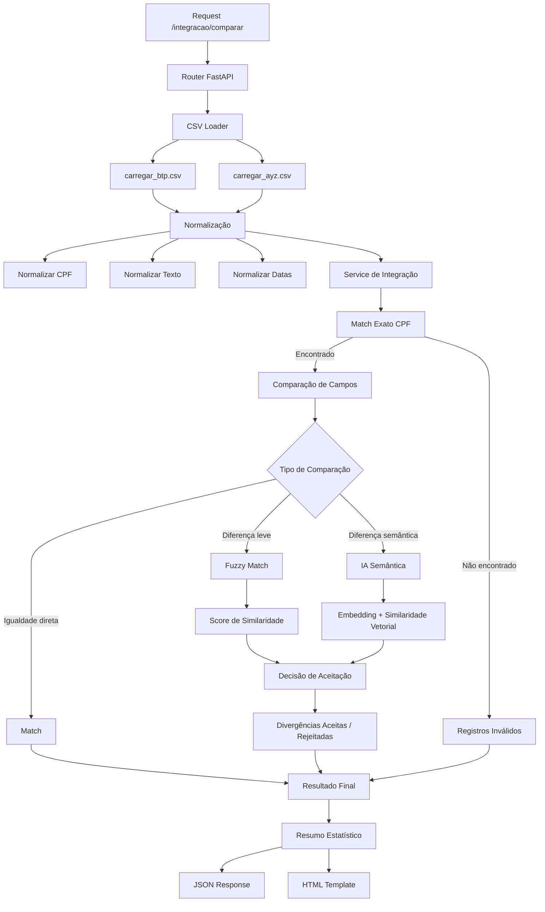

# Por que utilizar IA Semântica na Comparação de Dados

## Contexto do problema

No processo de integração entre os arquivos **AYZ** e **BTP**, observamos que os dados representam as mesmas entidades de negócio (funcionários, setores, cargos e unidades), porém com **variações textuais significativas**:

* Abreviações ("TI" vs "Tecnologia da Informação")
* Diferenças de grafia ("Analista Sistemas" vs "Analista de Sistemas")
* Sinônimos ("Jurídico" vs "Legal")
* Padrões organizacionais distintos entre sistemas

Essas diferenças tornam a simples comparação textual insuficiente.

---

## Limitações das abordagens tradicionais

### 1. Comparação exata (string equality)

* Extremamente rígida
* Falha em qualquer variação mínima
* Gera muitos falsos negativos

### 2. Regex e regras manuais

* Crescem de forma exponencial
* Difíceis de manter
* Não escalam com novos dados
* Altamente dependentes de conhecimento prévio

### 3. Fuzzy Matching (Levenshtein, token sort, etc.)

Embora útil em alguns cenários, o fuzzy matching **compara apenas similaridade textual**, não significado.

Exemplos onde o fuzzy falha:

| Valor A     | Valor B                  | Resultado Fuzzy | Interpretação Correta |
| ----------- | ------------------------ | --------------- | --------------------- |
| TI          | Tecnologia da Informação | Baixa           | Mesmo significado     |
| RH          | Recursos Humanos         | Baixa           | Mesmo significado     |
| Mkt Digital | Marketing                | Baixa           | Mesmo significado     |

---

## O que é IA Semântica

A IA semântica utiliza **modelos de linguagem baseados em embeddings** para transformar textos em vetores numéricos que representam **significado**, não apenas caracteres.

Com isso, conseguimos medir o quão próximos dois conceitos são semanticamente, mesmo que o texto seja diferente.

Exemplo conceitual:

```
"TI"  → vetor A
"Tecnologia da Informação" → vetor B
similaridade(A, B) ≈ 0.91
```

---

## Benefícios do uso de IA Semântica

### ✔️ Entendimento de significado

* Reconhece sinônimos
* Lida bem com abreviações
* Independe da ordem das palavras

### ✔️ Redução drástica de regras manuais

* Menos regex
* Menos tabelas de exceção
* Código mais limpo e sustentável

### ✔️ Escalabilidade

* Novos dados não exigem novas regras
* Funciona para diferentes domínios (setor, cargo, unidade)

### ✔️ Melhor qualidade de matching

* Menos falsos negativos
* Mais confiança nos resultados

---

## Uso de IA Semântica local (offline)

A solução proposta utiliza **modelos locais**, sem chamadas externas:

* Não envia dados sensíveis para a internet
* Atende requisitos de segurança e compliance
* Pode ser executada junto com a aplicação FastAPI

Tecnologias comuns:

* Sentence Transformers
* Modelos leves de embeddings

---

## Arquitetura adotada

```
CSV Loader
   ↓
Normalização (texto, CPF, datas)
   ↓
Comparação semântica (service)
   ↓
Classificação:
   - match
   - divergências
   - registros inválidos
```

A IA semântica atua **como camada de decisão**, não substituindo as validações básicas, mas complementando-as.

---

## Critério objetivo de decisão

A decisão de equivalência é baseada em um **score de similaridade**:

```python
SIMILARIDADE_MINIMA = 0.90
```

Isso torna o processo:

* Auditável
* Explicável
* Ajustável conforme o negócio

---

## Conclusão

O uso de IA semântica é a abordagem mais adequada para integração de dados corporativos heterogêneos porque:

* Resolve problemas que técnicas tradicionais não conseguem
* Reduz complexidade de código
* Melhora a qualidade da integração
* Escala melhor com o crescimento dos dados

Essa escolha demonstra maturidade técnica e alinhamento com práticas modernas de engenharia de software.


