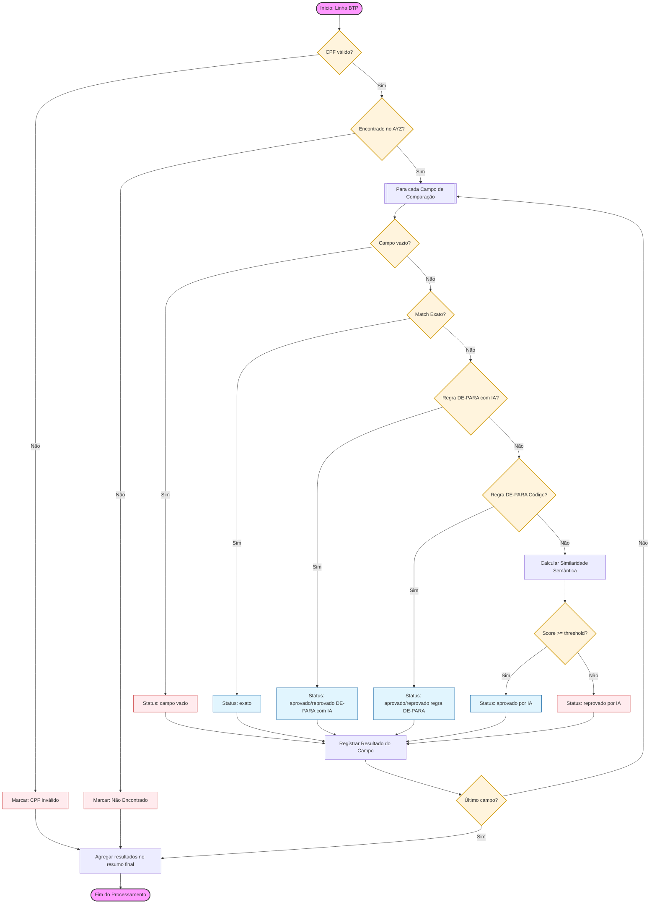

### Fluxo de Decisão ##

```mermaid
flowchart TD
    %% Estilos
    classDef start_end fill:#f9f,stroke:#333,stroke-width:2px;
    classDef decision fill:#fff4dd,stroke:#d4a017,stroke-width:2px;
    classDef status fill:#e1f5fe,stroke:#01579b,stroke-width:1px;
    classDef alert fill:#ffebee,stroke:#c62828,stroke-width:1px;

    %% Início e Validações Primárias
    Start([Início: Linha BTP]) --> CheckCPF{CPF válido?}
    
    CheckCPF -- Não --> ErrCPF[Marcar: CPF Inválido]
    CheckCPF -- Sim --> FindAYZ{Encontrado no AYZ?}
    
    FindAYZ -- Não --> ErrNotFound[Marcar: Não Encontrado]
    FindAYZ -- Sim --> LoopCampos[[Para cada Campo de Comparação]]

    %% Cascata de Decisão de Campos
    LoopCampos --> CheckVazio{Campo vazio?}
    
    CheckVazio -- Sim --> StVazio[Status: campo vazio]
    CheckVazio -- Não --> CheckExato{Match Exato?}
    
    CheckExato -- Sim --> StExato[Status: exato]
    CheckExato -- Não --> CheckDP_IA{Regra DE-PARA com IA?}
    
    CheckDP_IA -- Sim --> StDP_IA[Status: aprovado/reprovado DE-PARA com IA]
    CheckDP_IA -- Não --> CheckDP_Cod{Regra DE-PARA Código?}
    
    CheckDP_Cod -- Sim --> StDP_Cod[Status: aprovado/reprovado regra DE-PARA]
    CheckDP_Cod -- Não --> CalcSemantica[Calcular Similaridade Semântica]

    %% Validação Final da IA
    CalcSemantica --> CheckScore{Score >= threshold?}
    CheckScore -- Sim --> StIA_OK[Status: aprovado por IA]
    CheckScore -- Não --> StIA_NOK[Status: reprovado por IA]

    %% Consolidação
    StVazio & StExato & StDP_IA & StDP_Cod & StIA_OK & StIA_NOK --> Reg[Registrar Resultado do Campo]
    Reg --> FimLoop{Último campo?}
    FimLoop -- Não --> LoopCampos
    FimLoop -- Sim --> Resumo[Agregar resultados no resumo final]
    
    ErrCPF & ErrNotFound --> Resumo
    Resumo --> End([Fim do Processamento])

    %% Aplicação de Classes
    class Start,End start_end;
    class CheckCPF,FindAYZ,CheckVazio,CheckExato,CheckDP_IA,CheckDP_Cod,CheckScore,FimLoop decision;
    class StExato,StDP_IA,StDP_Cod,StIA_OK status;
    class ErrCPF,ErrNotFound,StIA_NOK,StVazio alert;


```