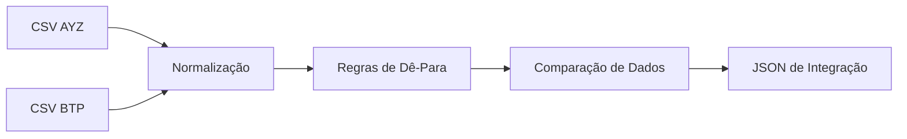

# 📄 Documento de Integração AYZ → BTP

## 1. Objetivo

Este documento descreve a proposta de **regras de normalização**, **identificação de divergências** e **tabelas de dê-para** entre os sistemas **AYZ (origem)** e **BTP (destino)**, a partir da análise dos arquivos CSV fornecidos.

O objetivo é garantir consistência, rastreabilidade e confiabilidade no processo de integração de dados de funcionários.

---

## 2. Visão Geral dos Sistemas

### Sistema AYZ (Origem)

* Exportado pelo cliente
* Estrutura menos padronizada
* Presença de campos com formatação inconsistente
* Uso de códigos próprios para unidades, setores e cargos

### Sistema BTP (Destino)

* Estrutura padronizada da plataforma integrada
* Regras rígidas de formatação
* Campos normalizados para integração com outros módulos

---

## 3. Principais Divergências Identificadas

### 3.1 CPF (Documento)

* AYZ: CPF com máscara (ex: `123.456.789-00`)
* BTP: CPF sem máscara (ex: `12345678900`)
* AYZ possui registros com CPF ausente

**Regra:**

* Remover caracteres não numéricos
* Validar tamanho (11 dígitos)
* Marcar registros inválidos ou ausentes

---

### 3.2 Nome do Funcionário

* Diferenças de acentuação e capitalização

Exemplo:

* AYZ: `João Silva Santos`
* BTP: `João Silva Santos`

**Regra:**

* Normalizar texto (trim, capitalização consistente)
* Manter acentuação quando possível

---

### 3.3 Unidades

| AYZ cod_unid | AYZ unidade           | BTP unit_code | BTP unit_name           |
| ------------ | --------------------- | ------------- | ----------------------- |
| UN01         | Matriz São Paulo      | U001          | São Paulo - Matriz      |
| UN02         | Filial Rio de Janeiro | U002          | Rio de Janeiro - Filial |
| UN03         | Filial BH             | U003          | Belo Horizonte - Filial |
| UN04         | Filial Curitiba       | U004          | Curitiba - Filial       |

**Regra:**

* Criar tabela de dê-para baseada no código da unidade
* Normalizar nomes para padrão BTP

---

### 3.4 Setores / Departamentos

| AYZ cod_setor | AYZ setor                  | BTP department_code | BTP department_name      |
| ------------- | -------------------------- | ------------------- | ------------------------ |
| ST10          | TI / Tecnologia            | D010                | Tecnologia da Informação |
| ST11          | RH / Gestão de Pessoas     | D020                | Recursos Humanos         |
| ST12          | Financeiro / Contabilidade | D030                | Financeiro               |
| ST13          | Vendas / Comercial         | D040                | Vendas                   |

**Regra:**

* Agrupar variações semânticas
* Manter granularidade do BTP

---

### 3.5 Cargos / Posições

| AYZ cod_cargo | AYZ cargo                  | BTP position_code | BTP position_name    |
| ------------- | -------------------------- | ----------------- | -------------------- |
| CG100         | Analista de Sistemas       | P100              | Analista de Sistemas |
| CG101         | Analista RH / RH Pleno     | P101              | Analista de RH       |
| CG103         | Contador / Contador Senior | P103              | Contador             |
| CG105         | Gerente de TI              | P105              | Gerente de TI        |

**Regra:**

* Mapear cargos equivalentes
* Padronizar nomenclatura

---

### 3.6 Datas

* AYZ: `DD/MM/YYYY`
* BTP: `YYYY-MM-DD`

**Regra:**

* Converter datas para ISO-8601

---

### 3.7 Status do Funcionário

| AYZ status | BTP employment_status |
| ---------- | --------------------- |
| ATIVO      | A                     |
| INATIVO    | I                     |

---

## 4. Regras Gerais de Normalização

1. Normalização de CPF
2. Padronização de texto
3. Conversão de datas
4. Dê-para de códigos organizacionais
5. Registro de inconsistências

---

## 5. Resultado Esperado

* Dados consolidados e comparáveis
* Identificação clara de divergências
* Base preparada para persistência no SQL Server
* Rastreabilidade entre origem e destino

---

## 6. Observações Finais

Este documento serve como base para:

* Implementação do endpoint de comparação
* Criação de testes automatizados
* Evolução futura para integração via banco de dados

---

## 7. Fluxo de Integração

